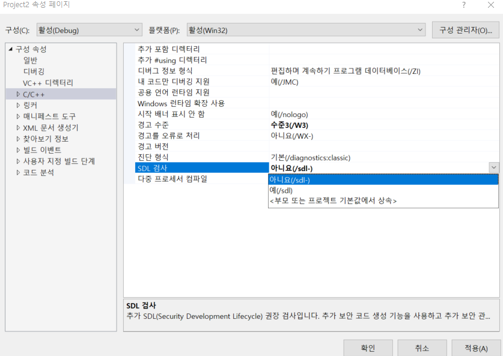

# 0강

스터디를 시작하기 전에 꼭 하셔야 할 것들 입니다. 막히는 부분이 있으면 카톡으로 알려주세요!

## 목차

* 백준 가입하기
* 개발환경 구축법
* 백준 입문하기

## 백준 가입하기

  
백준은 국내에서 가장 큰 알고리즘 문제 풀이 사이트 입니다. 알고리즘 종류 별로 문제를 풀 수 있고 가끔 열리는 대회도 참가할 수 있습니다.  
앞으로 스터디의 알고리즘 과제에 필요한 문제는 이곳에서 제공되고 채점될 예정이니 가입해 두시기 바랍니다.

## 개발환경 구축법

### Visual Studio 2017 설치

  
Visual Studio 2017은 가장 보편적인 C/C++ 개발 툴 입니다. 설치법은 [이 블로그](https://mapofbrain.tistory.com/12)에 잘 설명되어 있는 것 같습니다. 설치해주세요

### 프로젝트 생성

C언어를 실습하려면 프로그램을 작성할 공간이 필요합니다. Visual Studio에서는 솔루션-프로젝트-소스의 구조로 소스코드를 관리해 줍니다.  
하나의 프로젝트는 하나의 실행파일\(.exe\)를 만듭니다. 솔루션이란 것은 어떤 목적을 달성하기 위한 프로젝트가 여러개 필요할 때 그 프로젝트를 묶어서 한번에 관리해주는 것입니다. 프로젝트를 만들면 자동으로 솔루션으로 묶어서 생성됩니다. 우리는 하나의 프로젝트만 있으면 됩니다. 프로젝트를 만들어 봅시다.

  
검은 테마는 도구-&gt;옵션-&gt;환경-&gt;일반-&gt;색 테마-&gt;어둡게 로 설정할 수 있습니다.  
  
visuacl C++ -&gt; 빈 프로젝트를 골라 주세요.  
이름은 프로젝트 이름이고 위치는 프로젝트가 저장되는 곳 입니다.  
  
보기-&gt;솔루션 탐색기 로 솔루션의 구조를 볼 수 있습니다.  
소스파일 우클릭 -&gt; 추가 -&gt; 새항목 을 눌러서 소스를 추가 해봅시다.  
  
이름을 지어주고 추가를 누릅시다  
  
이곳이 앞으로 여러분들이 코딩할 공간입니다.

### 프로젝트 설정

원활한 코딩을 위해 프로젝트의 설정을 변경해 봅시다.  
  
프로젝트 우클릭-&gt;속성

### SDL 검사 해제

앞으로 배울 scanf 함수를 포함한 여러 취약한 함수들이 있습니다. 이러한 함수를 못쓰도록 Visual Studio가 막는데 우리는 크게 필요하지 않으니 해제해 줍시다.  
  
C/C++ -&gt; SDL검사 -&gt; 해제

### 하위 시스템 설정

프로그램이 동작을 마치면 자동으로 종료되는데 이러면 우리는 프로그램의 출력 결과를 볼 수 없습니다. 이를 막기 위해 하위 시스템을 콘솔로 설정해 줍시다  
  
링커 -&gt; 시스템 -&gt; 하위 시스템 -&gt; 콘솔

### 끝!

모든 준비가 끝났습니다.  
  
한번 따라쳐 보세요!  
컨트롤+F5 로 실행할 수 있습니다.  
  
이런 화면에 Hello World! 문구가 보인다면 정상적으로 작동된 것입니다.

## 백준 입문하기

사실 우리가 방금 작성한 코드로 백준에 있는 문제를 하나 풀 수 있습니다. 가봅시다!  
[2557\_Hello World](https://www.acmicpc.net/problem/2557)  
  
Hello World!를 출력하는 프로그램을 작성해야 하는 문제입니다. 우리는 방금 이 문제를 풀었습니다. 코드를 잘 모르겠어도 일단 한번 제출해 봅시다. 제출을 눌러주세요.  
  
언어로 C를 선택해 주고 제출을 누릅시다.  
소스코드 테마는 설정에서 바꿀 수 있습니다.  
  
축하합니다! 여러분은 백준에 입문하셨습니다. 앞으로 이런식으로 백준에서 문제를 풀게 될 것입니다.

